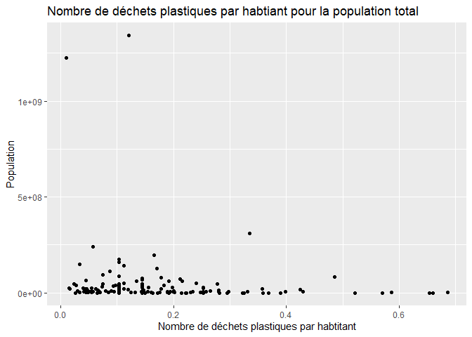
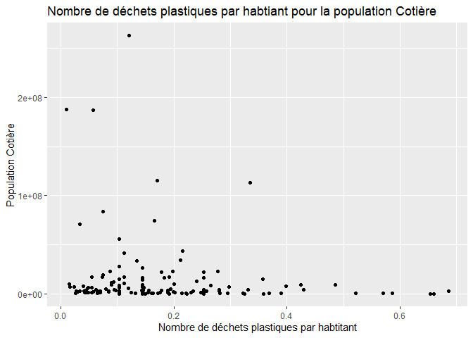
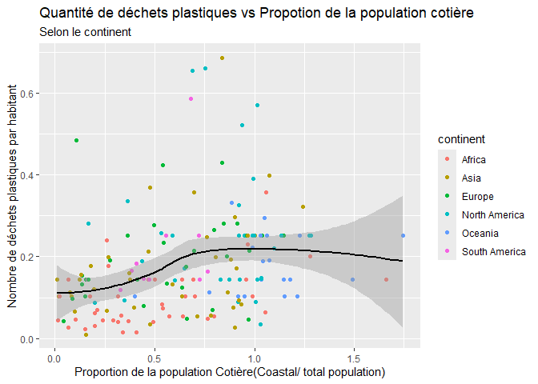

Lab 02 - Plastic waste
================
Ève Chartrand
20-09-25

## Chargement des packages et des données

View(plastic_waste)

``` r
library(tidyverse) 
```

``` r
plastic_waste <- read_csv("data/plastic-waste.csv")
```

Commençons par filtrer les données pour retirer le point représenté par
Trinité et Tobago (TTO) qui est un outlier.

``` r
plastic_waste <- plastic_waste %>%
  filter(plastic_waste_per_cap < 3.5)
```

## Exercices

ggplot(data = plastic_waste, aes(x = plastic_waste_per_cap)) +
geom_histogram(binwidth = 0.2)

plastic_waste %\>% filter(plastic_waste_per_cap \> 3.5)

plastic_waste \<- plastic_waste %\>% filter(plastic_waste_per_cap \<
3.5)

### Exercise 1

``` r
ggplot(data = plastic_waste, aes(x = plastic_waste_per_cap)) +
  geom_histogram(binwidth = 0.25) +
  facet_wrap(~ continent)
```

<!-- -->

### Exercise 2

``` r
ggplot(plastic_waste, aes(x = plastic_waste_per_cap, colour = continent, fill = continent)) +
    geom_density(alpha = 0.4) +
  labs(title = "Le densité de déchets plastiques par habitant", subtitle = "Pour chaque continent", x = "Nombre de déchets plastiques par habitant", y = "La densité")
```

<!-- -->

Le réglage de la couleur se fait dans aes puisque ces modifications
dépendent des données. Le réglage de alpha se fait dans la section geom
puisque cette propriétée ne dépend pas des variables du graphique, mais
plutôt de l’allure du graphique.

### Exercise 3

Boxplot:

``` r
ggplot(plastic_waste, aes(x = continent, y = plastic_waste_per_cap)) +
  geom_boxplot()+
  labs(title = "Le nombre de déchets plastiques par habtitant pour chaque continent", x = "Continents", y = "Nombre de déchets plastiques par habitants")
```

<!-- -->

Violin plot:

``` r
ggplot(plastic_waste, aes(x = continent, y = plastic_waste_per_cap)) +
  geom_violin() +
   labs(title = "Le nombre de déchets plastiques par habtitant pour chaque continent", x = "Continents", y = "Nombre de déchets plastiques par habitants")
```

<!-- -->

Le violin plot permet d’avoir une meilleure visualisation de l’étendue
des données puisque la distribution des données est démontré a l’aide de
la forme.

### Exercise 4

``` r
ggplot(plastic_waste, aes(x = plastic_waste_per_cap, y = mismanaged_plastic_waste_per_cap, colour = continent)) +
  geom_point() + 
  labs(title = "Nombre de déchets plastiques produits vs non gérés par habitant", x = "Nombre de déchets plastiques par habtitant", y = "Nombre de déchets plastiques non gérés par habitant")
```

<!-- --> Il
est possible d’observer que les pays qui ont une plus grande
consommations de déchets par habitant on en générale moins de déchets
non gérés.De plus, il y une forte concentration de donnée au début des
axes et cela montre une utilisation de plastic par habitant plutôt
similaire au nombre de déchet non gérés.

Les continants plus dévelloper comme l’amérique du Nord et l’Europe on
moins de déchet non gérés par rapport a la quantité de déchet qu’ils
produisent malgré le fait qu’ils produisent plus de déchet que d’autre
continents. Cependant les continents qui on plus de déchets non gérés on
un rapport déchet non géré et déchet par habitants plus élevé et ce sont
des endroits qui continnent des pays plus en difficulté en général.

### Exercise 5

``` r
ggplot(plastic_waste, aes(x = plastic_waste_per_cap, y = total_pop)) +
  geom_point() +
   labs(title = "Nombre de déchets plastiques par habtiant pour la population total", x = "Nombre de déchets plastiques par habtitant", y = "Population")
```

    ## Warning: Removed 10 rows containing missing values or values outside the scale range
    ## (`geom_point()`).

<!-- -->

``` r
ggplot(plastic_waste, aes(x = plastic_waste_per_cap, y = coastal_pop)) +
  geom_point() +
  labs(title = "Nombre de déchets plastiques par habtiant pour la population Cotière", x = "Nombre de déchets plastiques par habtitant", y = "Population Cotière")
```

<!-- -->

Oui, il semble avoir une relation un peu plus forte entre la population
total et le noombre de déchets par habitant. Cependant, il semble avoir
plus de population du coter cotier donc la relation semble être plutôt
semblable.

## Conclusion

Recréez la visualisation:

``` r
ggplot(plastic_waste, aes(x = coastal_pop / total_pop, y = plastic_waste_per_cap, colour = continent)) +
  geom_point() +
  geom_smooth(aes(group = 1), method = "loess", color = "black", se = TRUE) +
  labs(title = "Quantité de déchets plastiques vs Propotion de la population cotière", subtitle = "Selon le continent", x = "Proportion de la population Cotière(Coastal/ total population)", y = "Nombre de déchets plastiques par habitant")
```

    ## `geom_smooth()` using formula = 'y ~ x'

    ## Warning: Removed 10 rows containing non-finite outside the scale range
    ## (`stat_smooth()`).

    ## Warning: Removed 10 rows containing missing values or values outside the scale range
    ## (`geom_point()`).

<!-- -->

``` r
Plastic_waste_coastal <- plastic_waste %>%
  mutate(coastal_pop_prop = coastal_pop / total_pop) %>%
  filter(plastic_waste_per_cap < 3)
```

Il y a une proportion non linéaire entre le nombre de déchets plastiques
avec la population Cotière.
